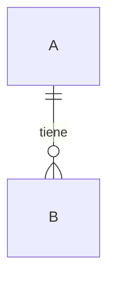

# Data Model — FARO

> Schema canónico. Cambios aquí requieren revisión del dueño de datos + actualización de tests de reglas.
> → [[03_Architecture/_index]] · [[07_Security/Security_Model]]

## Entidades
### <entidad>
| Campo | Tipo | Requerido | Notas |
|---|---|---|---|

## Relaciones

## Índices / consultas
| Consulta | Índice requerido |
|---|---|
